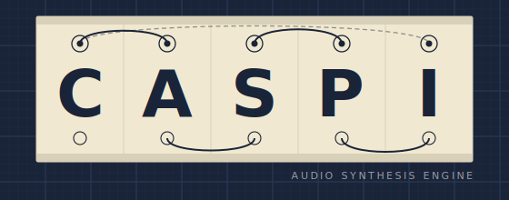

---

[](https://github.com/CalumSt/CASPI/actions/workflows/ci.yaml)


**CASPI** (C++ Audio Synthesis and Processing Interface) is a header-only C++ library providing modular building blocks for constructing synthesisers, enabling a drag-and-drop architecture.

Based on *The Computer Music Tutorial* and Will Pirkle's books. Pure header-only with no external runtime dependencies (only for tests and benchmarks).

## Features

### Oscillators
- **BlepOscillator** — Band-limited oscillator using PolyBLEP antialiasing; supports Sine, Saw, Square, Triangle, and Pulse waveforms with hard sync
- **Operator** — FM/PM synthesis operator with self-modulation (feedback), phase/frequency modulation modes, and built-in envelope
- **WavetableOscillator** — Wavetable-based oscillator for sample-accurate playback
- **LFO** — Low-frequency oscillator for modulation
- **Noise** — White noise generator

### Filters

- ` ⚠️ Coming soon! `

### Gain & Dynamics

- ` ⚠️ Coming soon! `

### Control
- **Envelope** — ADSR envelope generator with configurable attack, decay, sustain, and release stages
- **ModMatrix** — Modulation routing matrix connecting sources (LFOs, envelopes) to parameters with curve shaping (linear, exponential, logarithmic, S-curve)

### Synthesis
- **FMGraph** — FM synthesis engine with a mutable builder (non-RT) and immutable DSP runtime (RT-safe); validates graph topology at build time and executes operators in precomputed topological order

## Architecture

### Core Class Hierarchy

```
Node<FloatType>                    // Abstract base; sole virtual boundary (processBlock per block)
├── AudioNode<FloatType, Derived, Policy>  // CRTP; audio-rate
│   ├── Producer<...>              // No input; generates samples (oscillators)
│   └── Processor<...>             // Has input; transforms samples (filters, gain)
└── ControlNode<FloatType, Derived>         // CRTP; control-rate (one value per block)
```

Classes that produce audio inherit `Producer`. Classes that process audio inherit `Processor`. Control-rate sources (LFO, Envelope, ModMatrix) inherit `ControlNode`.

### Design Principles

- **Everything should sound good** — The guiding principle
- **Real-time safe** — No dynamic allocation or locking in render paths
- **Compile-time polymorphism** — CRTP eliminates virtual call overhead in hot paths
- **Framework agnostic** — No hard dependency on JUCE or other frameworks
- **Hierarchical** — Heavier classes build on lighter foundations; include only what you need

### Parameter System

All modulatable audio parameters use `ModulatableParameter<T>` with:
- Per-block smoothing to avoid clicks
- Logarithmic and linear scaling options
- Modulation input for LFO/envelope control

### SIMD Support

- SIMD abstractions for SSE, NEON and WASM SIMD with fallback to scalar
- Branchless waveforms enable compiler auto-vectorisation
- Denormal flushing via `ScopedFlushDenormals`

## Installation

### CMake (Recommended)

```cmake
add_subdirectory(path/to/CASPI)
target_link_libraries(your_target PRIVATE CASPI)
```

### Header-Only

Include directly in your source files:

```cpp
#include "caspi.h"                              // Full library
#include "oscillators/caspi_BlepOscillator.h"  // Single component
```

### Build Options

| Option | Default | Description |
|--------|---------|-------------|
| `CASPI_ENABLE_DEBUG` | OFF | Enable debug assertions and logging |
| `CASPI_BUILD_TESTING` | OFF | Build unit tests (requires GoogleTest) |
| `CASPI_BUILD_BENCHMARKS` | OFF | Build benchmarks (requires GoogleBench) |
| `CASPI_BUILD_PYTHON` | OFF | Build Python bindings (CASPy) |
| `CASPI_SANITIZER` | None | Sanitizer: Address, Undefined, Thread, Realtime |

## Examples

`⚠️ Live Demo coming soon!`

Checkout the example notebooks as part of CASPy (Python bindings) for interactive demos of oscillators, filters, and FM synthesis graphs.

## Project Structure

```
CASPI/
├── base/           # Core utilities, SIMD, constants, assertions
├── core/           # Node base classes, AudioBuffer, Parameter
├── controls/       # Envelope, ModMatrix
├── external/       # Third-party (concurrentqueue)
├── filters/        # SVF, OnePole
├── gain/           # Gain, Waveshaper
├── maths/          # FFT, math utilities
├── oscillators/    # BlepOscillator, Operator, Wavetable, LFO, Noise
└── synthesizers/   # FMGraph
```

## References

- The Computer Music Tutorial ( Roads, C. )
- Implementing Software Synthesisers ( Pirkle, W. )
- [Cytomic SVF Filter](https://cytomic.com/files/cybot.pdf)

## License

BSD-3-Clause. See [LICENSE.md](LICENSE.md).
